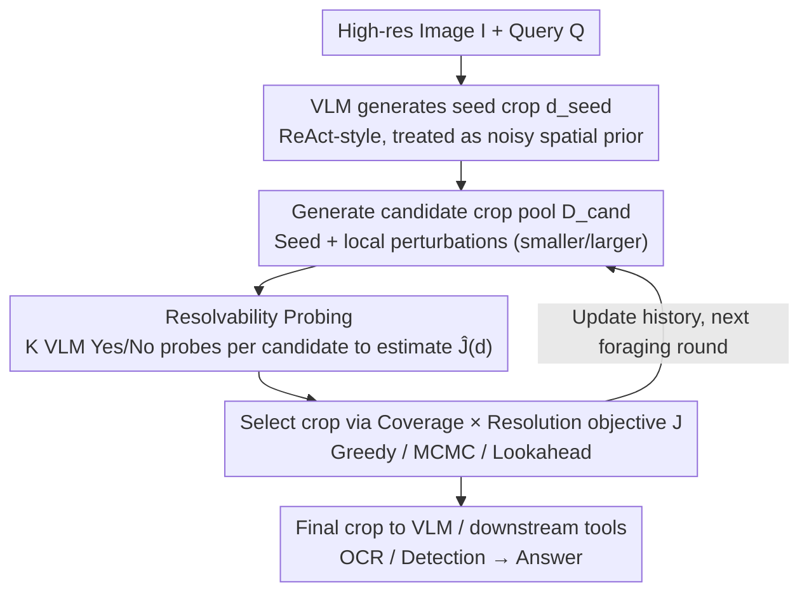

# The Perceptual Bandwidth Bottleneck in Vision-Language Models: Active Visual Reasoning via Sequential Experimental Design

**Conference**: ICML 2026  
**arXiv**: [2605.01345](https://arxiv.org/abs/2605.01345)  
**Code**: None  
**Area**: Multimodal VLM / Active Vision / Visual Agent  
**Keywords**: Perceptual Bandwidth Bottleneck, Bayesian Experimental Design, Active Visual Reasoning, High Resolution, Training-free

## TL;DR
This paper formalizes the issue of "VLMs lacking detail perception" as a Sequential Bayesian Optimal Experimental Design (S-BOED) problem and proposes FOVEA, a training-free module based on a computable proxy objective of "Coverage $\times$ Resolution," which consistently outperforms Direct and ReAct-style baselines on high-resolution and remote sensing benchmarks.

## Background & Motivation

**Background**: Modern VLMs (Qwen3-VL, GPT-5, Gemini 2.5, etc.) are already proficient in holistic scene understanding. Existing high-resolution processing methods fall into two categories: downsampling images into a fixed number of tokens for ViT encoders, or utilizing tool-calling where the VLM issues crop commands via ReAct or latent CoT to invoke expert tools like OCR/detection.

**Limitations of Prior Work**: In fine-grained tasks such as small object counting, OCR, and precise spatial localization, off-the-shelf VLMs exhibit "perceptual blindness"—making errors even when the reasoning logic is simple. Downsampling causes small objects to "disappear" before encoding; ReAct-style cropping is often heuristic and targets the wrong areas; and brute-force sliding windows are computationally expensive and introduce excessive noise.

**Key Challenge**: The authors identify this as a **perceptual bandwidth bottleneck**—ViT compresses images of any resolution into a fixed token count, creating an inevitable trade-off between "field-of-view (FOV) vs. resolution": seeing broadly sacrifices detail, while seeing detail sacrifices context. This is not purely a semantic reasoning failure but a failure to "acquire task-relevant evidence under limited bandwidth."

**Goal**: Transform the "where to look" decision from an ad-hoc heuristic into a decision-theoretic Optimal Experimental Design problem, providing a computable proxy objective in gigapixel continuous space.

**Key Insight**: Analogous to a scientist performing experiments—selecting a foveation (crop) is equivalent to choosing an experimental design $\mathbf{d}$ to reduce uncertainty regarding latent variables $\boldsymbol{\theta}=\{\ell, y\}$ (target location + semantic answer). The BOED framework is naturally suited for this "active information foraging" process.

**Core Idea**: Use the product of "Coverage $\times$ Resolution" as a computable proxy for Expected Information Gain and package it as a plug-in module to refine crops proposed by the VLM itself.

## Method

### Overall Architecture
The input consists of a high-resolution image $I$ and a query $Q$. The VLM first generates a seed crop $\mathbf{d}_{\text{seed}}$ in a ReAct style, which FOVEA treats as a noisy spatial prior. FOVEA then generates a candidate crop pool $\mathcal{D}_{\text{cand}}=\{\mathbf{d}_{\text{seed}}, \mathbf{d}_{\text{small}}, \mathbf{d}_{\text{large}}\}$, estimates a utility score $\hat{\mathcal{J}}$ for each candidate using resolvability probes, and selects the optimal crop using an optimizer (Greedy / MCMC / Lookahead). The selected view updates the interaction history $\mathcal{H}_t$, serving as the search state for the next foraging round—making FOVEA a sequential refinement process utilizing previous evidence. The final crop is fed back to the VLM or downstream tools (OCR/Detection) to produce the answer. The entire process is **completely training-free**, requiring only extra VLM calls as a scorer during inference.

### Key Designs

**1. S-BOED Formulation and Three-Layer Probabilistic Model:** Formulates "where to look" as optimal experimental design. To address heuristic crop decisions, active vision is reframed as S-BOED—each foveation $\mathbf{d}$ is an experiment to reduce uncertainty about $\boldsymbol{\theta}=\{\ell, y\}$. The model defines three layers: the **Physical Layer** defines bandwidth $\mathcal{B}$, information density $\rho(\mathbf{d})=\mathcal{B}/A(\mathbf{d})$, and resolution probability $\phi(\mathbf{d})=f_{\text{sat}}(\rho(\mathbf{d}))$; the **Generative Layer** introduces a binary visibility event $\mathcal{S}$, where $\mathcal{S}=1$ only if the target is both spatially covered ($\ell\in\mathbf{d}$) and resolved ($\phi=1$), otherwise observation $\mathbf{z}$ is background noise $p_0$; the **Decision Layer** aims to maximize Expected Information Gain (EIG). The authors note this violates submodularity—"broad views" or "random zooms" yield near-zero gain alone; only their sequence yields gain, creating an "Information Cliff" that necessitates look-ahead.

**2. Computable Coverage-Resolution Objective:** EIG in BOED is a nested expectation, intractable in gigapixel space. By assuming Factorised Belief ($p_t(\ell, y)\approx p_t(\ell)\cdot p_t(y)$), Calibrated Visibility ($H(\mathcal{S}|\mathbf{z},\mathbf{d})\approx 0$), and an Ideal Observer ($H(y|\mathbf{z},\mathcal{S}=1)\approx 0$), the authors derive $U_t(\mathbf{d})\approx H_t(y)\cdot\mathcal{J}_t(\mathbf{d})$, where $\mathcal{J}_t(\mathbf{d})=\left(\int_{\mathbf{x}\in\mathbf{d}}p_t(\mathbf{x})d\mathbf{x}\right)\cdot \phi(\mathbf{d})$ is the "Coverage $\times$ Resolution" product. Maximizing EIG becomes maximizing $\mathcal{J}_t$. This reduces complex semantic reasoning to geometric visibility maximization, leaving "understanding" to the VLM and "search" to FOVEA.

**3. Resolvability Probing and Optimizers:** Since the ground-truth belief map is unknown, FOVEA introduces a binary resolvability signal $r\in\{0,1\}$. $\hat{\mathcal{J}}(\mathbf{d})\approx P(\text{VLM}(I_\mathbf{d}, Q)=\text{"Yes"})$ represents whether the crop contains sufficient visual evidence. Each candidate is probed $K$ times (default $K=3$). FOVEA uses the VLM as its own critic without training. Three optimizers are supported: **Greedy** (selects max $\hat{\mathcal{J}}$), **MCMC-style** (iterative perturbation for local refinement), and **Lookahead** (uses simulated next-state value $\hat{V}(\mathbf{d}, \mathcal{H}_{t-1})$ to handle Information Cliffs).

### Loss & Training
The method is **completely training-free** with no parameter updates. FOVEA is inserted into the VLM crop calling path during inference. It incurs a cost of $|\mathcal{D}_{\text{cand}}|\times K$ extra VLM probes but improves crop quality through inference-time optimization.

## Key Experimental Results

### Main Results

| Method | Backbone | MME-RealW | CV-Bench | V* | HR-4K | HR-8K | Mean |
|------|----------|-----------|----------|-----|-------|-------|------|
| GPT-5 | Closed-source | 55.0 | 84.9 | 77.0 | 78.1 | 75.5 | 74.1 |
| Gemini 2.5 Flash | Closed-source | 58.5 | 87.3 | 80.1 | 83.4 | 80.9 | 78.0 |
| Direct | Qwen3-VL-30B | 48.2 | 81.2 | 81.2 | 80.0 | 75.9 | 73.3 |
| ReAct | Qwen3-VL-30B | 51.1 | 81.3 | 83.8 | 80.8 | 78.3 | 75.1 |
| RAP | Qwen3-VL-30B | 40.8 | 72.2 | 86.4 | 79.6 | 80.6 | 71.9 |
| **FOVEA** | Qwen3-VL-30B | **54.6** | **84.8** | **85.3** | **84.5** | 79.2 | **77.7** |
| Direct | Qwen3-VL-8B | 47.6 | 84.5 | 76.9 | 74.5 | 70.9 | 70.9 |
| ReAct | Qwen3-VL-8B | 48.1 | 83.9 | 78.8 | 77.7 | 73.8 | 72.5 |
| **FOVEA** | Qwen3-VL-8B | **49.9** | **84.7** | **83.6** | **80.9** | **75.4** | **74.9** |

On 30B models, FOVEA improves ReAct from 75.1 to 77.7, approaching Gemini 2.5 Flash. On 8B, it improves from 72.5 to 74.9. The strategy is effective across model scales.

### Ablation Study (Remote Sensing subset, search-dominated)

| Configuration | Accuracy | Description |
|------|--------|------|
| Direct (30B) | ~35% | Full image only, no active search |
| ReAct | 45.1% | Heuristic crop |
| FOVEA-Greedy | ~48% | With resolvability probe |
| FOVEA-MCMC | ~50% | Iterative refinement |
| **FOVEA-Lookahead** | **54.7%** | Explicit look-ahead for Information Cliff |
| Oracle Crop | ~65% | Upper bound with manual crop |

### Key Findings
- FOVEA yields the highest gains in search-dominated remote sensing scenarios, with Lookahead outperforming Greedy by over 6 points, validating the "Information Cliff" hypothesis.
- There remains a ~10 point gap between Oracle crop and FOVEA-Lookahead, illustrating "recognition bottlenecks" where the VLM fails even when the crop is correct.
- Greedy, MCMC, and Lookahead form a sequence of operating points on the accuracy-compute curve, allowing "inference-time scaling" by spending tokens to acquire visual evidence.

## Highlights & Insights
- **Linking active vision to BOED**: Unlike RL-based agents (Thyme, RAP), FOVEA provides a training-free solution grounded in decision theory using a "Coverage $\times$ Resolution" proxy.
- **The "Information Cliff" observation**: Explains why greedy strategies fail in high-res tasks—submodularity does not hold, making look-ahead a theoretical necessity.
- **Transferable resolvability probing**: Using $P(\text{VLM}=\text{Yes})$ as utility can be extended to web agents, tool use, or RAG retrieval where binary verification is possible.

## Limitations & Future Work
- Dependency on the Ideal Observer assumption; FOVEA cannot fix hallucinations inherent in the backbone VLM.
- Proposal-limited: If the seed crop is far from the target, local refinement cannot recover (cold-start problem).
- High inference latency due to extra VLM probes; FOVEA is a trade-off choice on the compute-accuracy curve.
- Future work: Training an amortized lightweight policy and adding meta-policies to decide when to activate FOVEA.

## Related Work & Insights
- **vs. ReAct / Thyme / RAP**: These use RL or heuristics for cropping. Ours is training-free BOED optimization during inference, outperforming RAP (77.7 vs 71.9) at 30B scale.
- **vs. BED-LLM (Choudhury et al. 2025)**: While they use BOED for question selection, FOVEA extends it to continuous gigapixel space, handling visibility gating.
- **vs. Visual CoT**: While text CoT spends tokens on "thinking," FOVEA spends tokens on "seeing," serving as a parallel axis for inference-time scaling.

## Rating
- Novelty: ⭐⭐⭐⭐⭐ S-BOED + Information Cliff + Coverage-Resolution product is a complete and novel framework.
- Experimental Thoroughness: ⭐⭐⭐⭐ Extensive benchmarks and gap analysis, though validation is primarily on the Qwen3-VL family.
- Writing Quality: ⭐⭐⭐⭐⭐ Clear organization of the three-layer model and explicit assumptions.
- Value: ⭐⭐⭐⭐ Training-free and easy to deploy, though probing overhead and cold-start issues remain.

<!-- RELATED:START -->

## Related Papers

- [\[ICML 2026\] Active Exploring like a Pigeon: Reinforcing Spatial Reasoning via Agentic Vision-Language Models](active_exploring_like_a_pigeon_reinforcing_spatial_reasoning_via_agentic_vision-.md)
- [\[NeurIPS 2025\] PhysVLM-AVR: Active Visual Reasoning for Multimodal Large Language Models in Physical Environments](../../NeurIPS2025/vlm_reasoning/physvlm-avr_active_visual_reasoning_for_multimodal_large_language_models_in_phys.md)
- [\[ICLR 2026\] VisuRiddles: Fine-Grained Perception is a Primary Bottleneck for Multimodal Large Language Models in Abstract Visual Reasoning](../../ICLR2026/vlm_reasoning/visuriddles_fine-grained_perception_is_a_primary_bottleneck_for_multimodal_large.md)
- [\[CVPR 2026\] Dr. Seg: Revisiting GRPO Training for Visual Large Language Models through Perception-Oriented Design](../../CVPR2026/vlm_reasoning/dr_seg_revisiting_grpo_training_for_visual_large_language_models_through_percept.md)
- [\[ICML 2026\] Native Active Perception as Reasoning for Omni-Modal Understanding](native_active_perception_as_reasoning_for_omni-modal_understanding.md)

<!-- RELATED:END -->
