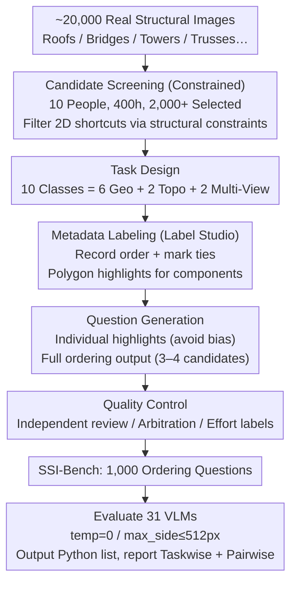

# Thinking in Structures: Evaluating Spatial Intelligence in Constraint-Governed Spaces

**Conference**: ICML 2026  
**arXiv**: [2602.07864](https://arxiv.org/abs/2602.07864)  
**Code**: https://ssi-bench.github.io  
**Area**: Multimodal VLM  
**Keywords**: Spatial Intelligence, Structured Reasoning, Ordering VQA, VLM Benchmark, 3D Constraints

## TL;DR
The authors construct SSI-Bench, a benchmark consisting of 1,000 ordering-based VQA questions focused on "constrained structured spaces" (real 3D structures like roofs, bridges, and towers). It requires VLMs to provide a complete permutation of 3–4 candidate components based on geometric or topological criteria. Evaluations of 31 VLMs reveal that the strongest closed-source model, Gemini-3-Flash, achieves only 33.6%, and the best open-source model, GLM-4.6V, reaches 22.2%, while humans achieve 91.6%. This highlights the lack of consistent spatial reasoning capabilities in current VLMs within real 3D scenes governed by joint geometric, connectivity, and physical feasibility constraints.

## Background & Motivation

**Background**: Spatial intelligence benchmarks are expanding along multiple axes—single-view vs. multi-view (SpatialRGPT, ViewSpatial-Bench), image vs. video (VSI-Bench, STI-Bench), and manual vs. automatic annotation (MMSI-Bench, Spatial457). These works typically model spatial reasoning as "scene-centric," measuring distance and orientation based on unconstrained indoor/outdoor daily environments.

**Limitations of Prior Work**: Scene-centric benchmarks suffer from fundamental ambiguity—3D relationships are often underdetermined in single images (an object could be smaller or further away), meaning multiple 3D configurations can explain the same 2D observation. Consequently, models can "guess correctly" using appearance priors or dataset biases without truly recovering 3D structures.

**Key Challenge**: In the real world, truly reliable spatial reasoning often occurs in *structure-constrained* scenes (bridges, roofs, towers), where geometric laws, connectivity constraints, and physical feasibility strictly narrow down candidate 3D states. Existing benchmarks either use completely unconstrained daily scenes or simplistic synthetic shapes (CLEVR, Spatial457), failing to preserve the combination of "real visual complexity + strong structural constraints."

**Goal**: (i) Formally define Structure-Centric Spatial Reasoning (SCSR); (ii) construct a VQA benchmark that preserves real 3D complexity while ensuring unique candidate relationships; (iii) use ordering questions as the evaluation format to force models to parse relative 3D relationships among all candidates; (iv) systematically evaluate 31 VLMs and diagnose typical failure modes.

**Key Insight**: Represent the scene as a node-component graph $\mathbf{s}=(V,E,\mathbf{G},\mathbf{A})$, where geometric degrees of freedom $\mathbf{G}$ and discrete attributes $\mathbf{A}$ are restricted by *explicit equality constraints* $\mathbf{c}(\mathbf{s})=\mathbf{0}$ and *inequality constraints* $\mathbf{h}(\mathbf{s})\leq\mathbf{0}$. These constraints are not provided to the model but are used to *construct* samples where candidate orderings are uniquely determinable. This maintains visual complexity while strictly defining the ground truth.

**Core Idea**: Elevate spatial intelligence evaluation from "measuring distance/direction" to "ordering all candidate 3D relationships," using structural constraints to make orderings uniquely determinable, thereby decoupling the model's spatial reasoning from 2D pixel shortcuts.

## Method

### Overall Architecture
The construction and evaluation of SSI-Bench follow a human-centric pipeline: (1) Candidate Screening—scanning ~20,000 structural images from copyright-free galleries (Unsplash, Pexels, Pixabay) and author-captured photos; 10 researchers spent 400+ hours selecting 2,000+ candidates covering space trusses, steel towers, cable-stayed bridges, timber trusses, reinforced frames, and piping systems, intentionally filtering out cases solvable via 2D pixel cues. (2) Task Design—10 categories divided into geometric and topological families, plus a multi-view subset. (3) Metadata Labeling—using Label Studio to record ascending orders, tie cases, and annotate polygons to highlight target components. (4) Question Generation—rendering a separate highlighted image for each candidate to avoid occlusion and color bias, then instantiating them into full-ordering VQA. (5) Quality Control—reviews by independent inspectors, third-party arbitration for disagreements, and difficulty labeling. Finally, 31 VLMs are evaluated zero-shot under a unified protocol. Three core designs support this pipeline: constrained screening for unique ground truth, a 10-task system for diagnostic breadth, and an ordering VQA protocol to force full relationship parsing.

### Key Designs

**1. SCSR Formalization + Three Types of Structural Constraints: Unique Ground Truth via Constraints**

The weakness of scene-centric benchmarks is ambiguity—"smaller object" and "further object" can explain the same 2D observation. Models can guess correctly using appearance priors without reconstructing 3D. SSI-Bench models each image as a structural state $\mathbf{s}=(V,E,\mathbf{G},\mathbf{A})$, where the feasible set $\mathcal{M}=\{\mathbf{s}:\mathbf{c}(\mathbf{s})=\mathbf{0},\,\mathbf{h}(\mathbf{s})\leq\mathbf{0}\}$ is restricted by three constraint types: geometric laws (symmetry, equality of lengths/directions), topological connectivity (the graph $\mathcal{G}=(V,E)$ determines collinearity/coplanarity), and physical feasibility (non-intersection, support conditions).

Crucially, these constraints are **not fed to the model**. Instead, they are used during construction to filter out ambiguous cases, leaving only uniquely determinable orderings. The model must rely solely on the image, but the ground truth is guaranteed by constraints, making "true 3D recovery" the only path to a correct answer and blocking 2D shortcuts.

**2. Ordering VQA Evaluation Protocol: Forcing Relationship Parsing via Full Permutations**

To measure "full relationship understanding" rather than "guessing," this work replaces binary/multiple-choice with full-ordering questions for $K \in \{3,4\}$ candidates. Each question provides a candidate set $\mathcal{C}=\{c_i\}_{i=1}^K$ and a criterion function $f_\tau(\mathbf{s}, c)$ (e.g., centroid height, angle with ground, convex hull volume). The ground truth is $\pi^\star=\arg\mathrm{sort}_{\pi\in S_K}(f_\tau(\mathbf{s}, c_{\pi(1)}), \dots, f_\tau(\mathbf{s}, c_{\pi(K)}))$. Models must output a parseable Python list. Results report both Taskwise Accuracy (exact match of the full permutation) and Pairwise Accuracy (consistency across pairs).

The benefit of full ordering is quantified by difficulty: for member-level tasks ($K=4$), the random baseline is only $1/4!\approx 4.2\%$; for group-level tasks ($K=3$), it is $1/3!\approx 16.7\%$. The combined average random baseline is 12.85%, significantly lower than the 50% in binary tasks. Solving it requires parsing all $\binom{K}{2}$ pairwise relationships.

**3. 10 Task Classes Covering Geometry + Topology + Multi-View: Diagnostic Breadth in Constrained Spaces**

Since single tasks (e.g., distance) are easily solved by existing priors, the benchmark provides 10 classes. The Geometric family (6): Ground Height (centroid height), Ground Angle (angle with ground), Dimension (main axis length), Relative Distance (minimum distance between axes), Area (planar convex hull area), and Volume (3D convex hull volume). The Topological family (2): Hop Distance (shortest path in connectivity graph) and Cycle Length (minimal cycle length). Additionally, two Multi-View subsets provide two images (one highlighting reference Member 0, one highlighting targets), forcing cross-view correspondence.

This combination forces the model to utilize mental rotation, cross-section reasoning, occlusion reasoning, and force-path reasoning within the same benchmark, allowing for fine-grained diagnosis of where the model fails—e.g., low scores in multi-view tasks point directly to a lack of cross-view correspondence.

### Loss & Training
The benchmark is for evaluation only; no models were trained. All 31 VLMs performed zero-shot inference under a unified protocol (temperature=0, maximum side length 512 pixels) using task-specific prompt templates.

## Key Experimental Results

### Main Results
Table 2 summarizes Taskwise Accuracy for representative models on SSI-Bench (Geometric Mean, Topological Mean, and Total Mean). Full results for all 10 tasks are in the original paper.

| Model | Geo Mean | Topo Mean | Total Mean | vs Random (12.85%) |
|------|----------|----------|--------|--------------------|
| Human (Average) | ~91 | ~89 | **91.60** | +78.75 |
| Gemini-3-Flash (proprietary) | ~33 | ~32 | **33.60** | +20.75 |
| GPT-5.2 | ~30 | ~26 | 29.10 | +16.25 |
| Gemini-3-Pro | ~29 | ~29 | 29.50 | +16.65 |
| Seed-1.8 | ~25 | ~29 | 25.90 | +13.05 |
| GLM-4.6V (best open-source) | ~22 | ~23 | 22.20 | +9.35 |
| Qwen3-VL-235B-A22B | ~21 | ~24 | 21.90 | +9.05 |
| InternVL3.5-2B (worst large) | ~12 | ~7 | 11.10 | −1.75 |
| Random Guessing | 12.85 | 12.85 | 12.85 | 0 |

### Analysis of Thinking
The impact of reasoning (thinking) was analyzed for Gemini-3-Pro (high vs. low thinking) and Qwen3-VL-30B-A3B (Thinking vs. Instruct).

| Setting | w/o Thinking | w/ Thinking | Gain |
|------|--------------|-------------|------|
| Gemini-3-Pro (low → high) | 27.1% | 29.5% | +2.4 |
| Qwen3-VL-30B-A3B (Instruct → Thinking) | 20.6% | 22.5% | +1.9 |

### Key Findings
- **Massive Human-VLM Gap**: The strongest closed-source model (Gemini-3-Flash) reaches only 33.60%, and the best open-source model (GLM-4.6V) reaches 22.20%, leaving a gap of 60+ points from the human 91.60%. Many open-source models hover near the 12.85% random baseline, showing SCSR cannot be cheated via 2D heuristics.
- **Closed-source vs. Open-source Divergence**: All open-source models cap at around 22%, 10+ points behind the Gemini-3 series. Furthermore, the progression from GLM-4.5V to 4.6V shows only a +0.8 gain, suggesting that *scaling up alone is insufficient*.
- **Limited and Non-monotonic Thinking Gains**: The relationship between thinking token usage and accuracy is not monotonic; performance peaks at moderate usage and declines with more tokens. Token usage correlates weakly with effective reasoning; excess tokens often correspond to "cycling through incorrect 3D assumptions."
- **Negative Impact on Multi-view and Volume**: For tasks requiring globally consistent 3D reconstruction, longer reasoning can sometimes amplify errors.

### Error Analysis (Based on 100-question manual diagnosis for Gemini-3-Pro)
The authors identified four typical failure modes: Component Extent Error (mistaking a fragment for the whole under occlusion), Object Recognition Error (confusing stair treads with diagonal braces), Calculation & Logic Error (optimizing projected area for volume tasks; using vertical instead of slanted height), and View Fusion Error (failing to find Member 0 correspondences across views).

## Highlights & Insights
- Using "structural constraints" as implicit priors for sample construction—rather than explicit inputs—cleverly turns the benchmark into a probe for 3D grounding. The model must infer 3D from the image, while ground truth uniqueness is guaranteed. This approach is transferable to robotics, medical anatomy, etc.
- Ordering VQA is an underrated evaluation format: it has a low random baseline, prevents single-item guessing, and forces global relationship parsing, making it better suited for measuring "true understanding" than MCQs.
- The finding that "thinking gains are marginal and non-monotonic" is significant—it suggests the bottleneck for reasoning-enhanced VLMs is 3D representation, not reasoning length. Simple chain-of-thought cannot solve SCSR.
- Error classifications (Extent/Recognition/Calculation/Fusion) can guide targeted improvements: e.g., extent errors could be mitigated via part-segmentation assistance.
- Evaluating 31 models against human and random baselines provides comprehensive diagnostic value over simple leaderboard ranking.

## Limitations & Future Work
- The 1,000-question scale is relatively small; the Geometric family is overrepresented compared to Topological tasks (Hop Distance/Cycle Length), which have fewer samples for trend analysis.
- Source images are primarily from Unsplash/Pexels/Pixabay, focusing on "aesthetically pleasing" structures like bridges and towers; industrial-grade CAD/BIM scenarios (pipe routing, force paths) are not yet covered.
- View pairing bias exists in the multi-view subset where authors captured additional photos. Expansion to 6-view or NeRF/3DGS rendered views would offer a more comprehensive 3D consistency diagnosis.
- Evaluation was strictly zero-shot; exploring whether providing auxiliary sketches or point clouds helps models cross the 33% threshold is a clear next step.
- Error analysis was limited to Gemini-3-Pro; the universality of these findings across other model families requires further verification.

## Related Work & Insights
- Complementary to *scene-centric* spatial benchmarks (VSI-Bench, SpatialRGPT, SpatialVLM), which evaluate distance/direction in unconstrained daily environments. SSI-Bench evaluates ordering in constrained scenes.
- Linked to multi-view benchmarks (MMSI-Bench, ViewSpatial-Bench, MindCube); the Multi-View subset in this work directly targets this direction and reports differences from single-view tasks.
- Compared to structural understanding benchmarks (PartNet, 3DCoMPaT++, ABC, GeoQA) that provide explicit part labels or geometric outputs, SSI-Bench acts as an implicit probe, requiring models to reconstruct structures internally to answer spatial relationship questions.
- Implications for VLM training: Component-level segmentation supervision, cross-view correspondence learning, and explicit 3D intermediate representations (e.g., NeRF/3DGS distillation) may be more effective than increasing reasoning length. The *constrained sample construction* method can be generalized to high-determinacy fields like medical imaging (anatomical constraints) or autonomous driving (road geometry).

## Rating
- Novelty: To be evaluated
- Experimental Thoroughness: To be evaluated
- Writing Quality: To be evaluated
- Value: To be evaluated

<!-- RELATED:START -->

## Related Papers

- [\[ICML 2026\] ReVSI: Rebuilding Visual Spatial Intelligence Evaluation for Accurate Assessment of VLM 3D Reasoning](revsi_rebuilding_visual_spatial_intelligence_evaluation_for_accurate_assessment_.md)
- [\[ICLR 2026\] Spatial-DISE: A Unified Benchmark for Evaluating Spatial Reasoning in Vision-Language Models](../../ICLR2026/vlm_reasoning/spatial-dise_a_unified_benchmark_for_evaluating_spatial_reasoning_in_vision-lang.md)
- [\[CVPR 2026\] SpatiaLQA: A Benchmark for Evaluating Spatial Logical Reasoning in Vision-Language Models](../../CVPR2026/vlm_reasoning/spatialqa_a_benchmark_for_evaluating_spatial_logical_reasoning_in_vision-languag.md)
- [\[CVPR 2025\] Thinking in Space: How Multimodal Large Language Models See, Remember, and Recall Spaces](../../CVPR2025/vlm_reasoning/thinking_in_space_how_multimodal_large_language_models_see_remember_and_recall_s.md)
- [\[ICML 2026\] Efficient Reasoning with Hidden Thinking](efficient_reasoning_with_hidden_thinking.md)

<!-- RELATED:END -->
