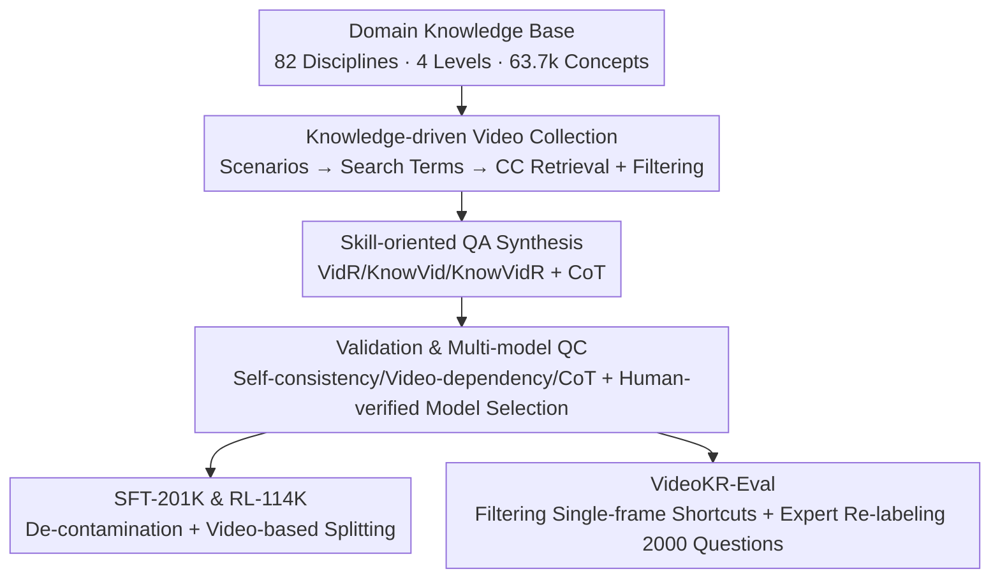

# VideoKR: Towards Knowledge- and Reasoning-Intensive Video Understanding

**Conference**: ICML 2026  
**arXiv**: [2606.05259](https://arxiv.org/abs/2606.05259)  
**Code**: To be confirmed (The paper declares open-sourcing the corpus and benchmark)  
**Area**: Multimodal VLM / Video Reasoning  
**Keywords**: Video Understanding, Knowledge-Intensive Reasoning, Post-training Corpus, Skill-oriented QA Synthesis, CoT Supervision

## TL;DR
VideoKR is the first large-scale post-training corpus specifically oriented towards "knowledge- and reasoning-intensive video understanding." It features 145,000 newly collected CC-licensed professional domain long videos and 315,000 synthesized QAs with Chain-of-Thought (CoT) reasoning. The "human-in-the-loop + skill-oriented" synthesis pipeline ensures difficulty, diversity, and reliability. Additionally, the VideoKR-Eval benchmark is constructed by removing "single-frame answerable" shortcuts. Under a standard SFT→GRPO workflow, data design alone allowed a 7/8B model to outperform previous post-training methods in knowledge-intensive video reasoning.

## Background & Motivation
**Background**: Video Multimodal Large Models (MLLMs) are advancing rapidly through architectural improvements, large-scale pre-training, and complex post-training (various RLVR variants, reward engineering). However, they still struggle significantly when moving from "surface-level video perception" to "video reasoning requiring domain knowledge and multi-step inference."

**Limitations of Prior Work**: The authors point out that the bottleneck lies in the training corpora rather than algorithms. Existing large-scale video datasets are almost all constructed for perceptual goals (action recognition, event localization, short-range temporal relations), with content heavily biased toward daily activities and lacking professional domain coverage. Moreover, many datasets reuse short videos released years ago and synthesize data using a single model (e.g., GPT-4o), which introduces systematic bias; many samples can even be answered correctly without watching the video.

**Key Challenge**: Training models capable of true knowledge-intensive video reasoning requires data that is "professional domain + truly video-dependent + contains reliable reasoning chains." Such data does not exist in ready-made sources, cannot be manually constructed at scale, and pure model synthesis introduces bias.

**Goal**: To construct a large-scale, high-quality, commercially usable (CC-licensed) post-training corpus that truly demands deep video reasoning, accompanied by an evaluation benchmark that is not compromised by "text/single-frame shortcuts."

**Key Insight**: Dissect "knowledge- and reasoning-intensive video understanding" into three complementary skills (perception, knowledge, reasoning) and synthesize QAs oriented around these skills. Reliability is ensured by inserting domain expert reviews at every step involving model output, combining "scalable model synthesis" with "reliable human quality control."

**Core Idea**: Generate data using "domain knowledge base driven collection + skill-oriented QA synthesis + human-in-the-loop multi-model quality control." This makes data design the primary driver of progress in video reasoning—using standard SFT→GRPO as a controlled scaffolding to cleanly attribute performance gains to the data.

## Method

### Overall Architecture
The core output of VideoKR is its data, and the pipeline is a "semi-automated quality control" process. First, experts audit 82 professional disciplines to organize a domain knowledge base of 63,700 knowledge points across four levels: "Discipline → Course → Lecture → Concept." Next, these knowledge points generate real-world scenarios, transformed into search terms for YouTube CC-licensed retrieval and multi-round filtering (metadata → visual → safety), resulting in 146,000 videos. For each video, multiple QAs with CoT reasoning chains are generated for each of the three core skills, followed by triple filtering (self-consistency, video-dependency, CoT). Throughout the process, a "human-verified multi-model selection protocol" picks qualified models from a pool of 7 frontier models. Finally, after de-contamination and video-based splitting into SFT-201K and RL-114K, the VideoKR-Eval benchmark is built.

### Key Designs

**1. Knowledge-driven Video Collection: Making Videos "Imply" Knowledge rather than "Explain" Knowledge**

Addressing the "daily-life bias" of existing corpora, the authors manually curated undergraduate courses from top universities to define 82 disciplines across Natural Sciences, Medicine, Humanities/Social Sciences, and Engineering. The 63,700 knowledge points were refined layer by layer. A critical tactic is "scenario-based retrieval": searching "Newton’s Second Law" only yields lecture recordings, so LLMs generated 1–3 real-world scenarios (e.g., "rocket launch") for each concept, which were converted into semantically related search terms to find videos that "embody" rather than "explain" the knowledge. Retrieval was limited to CC licenses, excluded videos >30 minutes, and passed through three rounds of filtering (metadata, visual relevance, Azure image moderation), resulting in 146,000 videos (average length 344s).

**2. Skill-oriented QA Synthesis: Decomposing "Knowledge-Intensive Reasoning" into Three Directable Capabilities**

The target capability is split into three complementary core skills: ① Basic Video Reasoning (VidR): Understanding visible events without external knowledge (e.g., tracking actions, spatial relations); ② Knowledge-enhanced Video Perception (KnowVid): Enriching visual perception with domain knowledge (e.g., identifying a "burette" and its role in chemistry); ③ Knowledge-intensive Video Reasoning (KnowVidR): Fusing visual understanding with domain knowledge for multi-hop reasoning (e.g., estimating product amount from observed reactants). Experts labeled 150 seed samples per skill per discipline. Synthesis involved frontier MLLMs given 0.2 fps timestamped frames, 3 seed samples, and the knowledge concept to generate 2 QAs per skill (Total 6 per video) with CoT.

**3. Triple Validation + Multi-model QC: suppressing "Synthesis Errors," "Text Shortcuts," and "Single-model Bias"**

Three filtering steps were used to ensure quality: ① Self-consistency validation: Feeding the question and frames back into the model to re-solve; only consistent answers are kept. ② Video-dependency filtering: InternVL3.5-38B and Qwen3-VL-32B solved questions given only "text + 4 frames"; if both were correct, the sample was deleted (stricter than text-only filtering). ③ CoT chain verification: Independent strong MLLMs checked if each step was supported by observable evidence or domain knowledge. Crucially, a "human-verified multi-model selection" was used. Instead of one model, a pool of 7 frontier models (GPT-x, Claude-x, Gemini-x) was maintained. Experts audited error rates for each model on each task; models only performed tasks where their error rate was below a threshold.

**4. VideoKR-Eval: Filtering "Answerable without Video" Shortcuts**

Audit of VideoMMMU/MMVU revealed high shortcut rates (>35% single-frame answerable). VideoKR-Eval was built using "multi-model single-frame detection": for each question, Qwen3-VL, Claude-4.5, and GPT-x were given "question + options + 1 random frame." Only questions where all three failed to solve the task three times were judged "requiring continuous video understanding" (1,254 tasks). Another 746 tasks were expert-labeled based on clear video evidence and domain knowledge, totaling 2,000 tasks. The single-frame answerable rate on VideoKR-Eval is suppressed to ~10%.

### Loss & Training
Standard SFT→GRPO was used as a controlled scaffolding. Based on Qwen2.5-VL-7B-Instruct and Qwen3-VL-8B-Instruct, the models were first fine-tuned on SFT-201K for 1 epoch (CoT as supervised target), then underwent GRPO on RL-114K for 1 epoch. Accuracy rewards used ROUGE for open-ended questions and exact match for multiple-choice. Max video tokens were 4,096 across 128 frames. Evaluation used LMMs-Eval with official prompts and mean of three runs to ensure reproducibility.

## Key Experimental Results

### Main Results
Across 7 benchmarks, VideoKR post-training showed the most significant gains in knowledge-intensive tasks while maintaining performance on general tasks.

| Model | General Avg | VideoKR-Eval | Knowledge-Intensive Avg |
|------|---------|-------------|------------|
| Qwen2.5-VL-7B-Instruct (Base, 128f) | 64.1 | 32.7 | 41.9 |
| VideoAuto-R1 (128f) | 65.6 | 36.5 | 44.3 |
| **VideoKR SFT+RL (128f)** | 65.5 | **41.2** | **46.6 (+4.7)** |
| Qwen3-VL-8B-Instruct (Base, 128f) | 65.9 | 39.0 | 48.5 |
| Qwen3-VL-8B-Thinking | 65.2 | 41.5 | 50.0 |
| **VideoKR SFT+RL (Qwen3, 128f)** | 65.4 | **45.3** | **51.5 (+3.0)** |

In Knowledge-Intensive Avg, Qwen2.5-VL-7B improved from 41.9 to 46.6 (+4.7), and Qwen3-VL-8B from 48.5 to 51.5 (+3.0), achieving the best performance in the 7/8B category.

### Ablation Study
Standardized on Qwen2.5-VL-7B, 128 frames, SFT 80K/1 epoch (RL at 50K/1 epoch GRPO).

| Configuration | General Avg | VideoKR-Eval | Knowledge-Intensive Avg | Note |
|------|---------|-------------|------------|------|
| Base Qwen2.5-VL-7B | 64.1 | 32.7 | 41.9 | Reference |
| VidR only | 58.0 | 35.3 | 41.4 | Basic reasoning only |
| VidR+KnowVid | 58.4 | 35.9 | 41.3 | + Knowledge perception |
| VidR+KnowVid+KnowVidR | 58.3 | 36.8 | 42.4 | All three (Best) |
| Direct Output (No CoT) | 61.4 | 35.9 | 39.4 | W/o CoT Supervision |
| Chain-of-Thought | 58.3 | 36.8 | 42.4 | CoT Supervision (+3.0) |
| Video-R1-CoT-165k | 57.3 | 27.5 | 36.2 | Old corpus drop |
| **VideoKR-SFT-201K (Ours)** | 58.3 | 36.8 | 42.4 | Only corpus > Base |

### Key Findings
- **Three Skills are Essential**: Knowledge-intensive performance improved monotonically from VidR → +KnowVid → +KnowVidR, showing that overlapping domain knowledge with multi-hop reasoning is critical.
- **CoT Supervision is Vital**: Removing CoT dropped the knowledge-intensive average from 42.4 to 39.4 (−3.0); high-quality reasoning chains are the core of eliciting deep reasoning.
- **Data Quality > Data Quantity**: Under SFT, only VideoKR-SFT (42.4) surpassed the base model (41.9). Video-R1/VideoRFT actually degraded performance (36.2/38.4), validating that data design is the bottleneck.
- **SFT+RL Complementarity**: RL consistently improved upon SFT checkpoints, and RL-only performed better than SFT-only, suggesting the fusion of both is necessary to unlock VideoKR's full value.

## Highlights & Insights
- **Scenario-based Retrieval**: Using "rocket launch" instead of "Newton's Second Law" fundamentally shifts the data from "lectures explaining knowledge" to "real videos implying knowledge," which is crucial for collecting videos that actually require reasoning.
- **Video-Dependency as a "Shortcut Gate"**: Deleting samples answerable via 4 frames during training cleanses the "shortcut" data at the source, which is more effective than just preventing shortcuts during evaluation.
- **Human-Verified Multi-Model Selection**: Transitioning from single-model synthesis to step-specific, human-audited model assignment suppresses systematic bias and improves diversity—a reusable engineering paradigm for quality control.
- **Using Primitive SFT→GRPO as Scaffolding**: Avoiding complex RL designs to cleanly attribute gains to the data itself makes the methodology highly persuasive and addresses the "algorithmic over-stacking" in the field.

## Limitations & Future Work
- Excluding videos >30 minutes means long-context reasoning is explicitly out of scope.
- Synthesis and QC rely heavily on 7 frontier models and 34 domain experts, making it costly to replicate. Residual noise still exists (17/800 samples in human audit had incorrect answers).
- Evaluation focuses on multiple-choice/open-ended questions with ROUGE/Exact Match rewards, providing limited granularity for long reasoning chains.
- Performance on general benchmarks occasionally experienced minor drops—the "tax" of specializing in professional domains.

## Related Work & Insights
- **vs Video-R1 / VideoRFT**: These reuse existing short videos and single-model synthesis with ambiguous copyrights. VideoKR uses all newly collected CC-licensed professional videos with longer average durations; it is the only one to surpass base models in SFT comparisons.
- **vs VideoMMMU / MMVU**: These benchmarks were found to have high single-frame shortcut rates (>35%). VideoKR-Eval suppresses this to ~10% via multi-model detection and expert re-labeling, providing more credible evaluation.

## Rating
- Novelty: ⭐⭐⭐⭐ Solid innovation in the data pipeline rather than algorithm.
- Experimental Thoroughness: ⭐⭐⭐⭐⭐ Clear attribution via multi-base primary experiments and multi-dimensional ablations.
- Writing Quality: ⭐⭐⭐⭐⭐ Motivations and technical details are well-documented.
- Value: ⭐⭐⭐⭐⭐ Open-source CC corpus + shortcut-proof benchmark provide significant infrastructure value.

<!-- RELATED:START -->

## Related Papers

- [\[CVPR 2026\] Towards Sparse Video Understanding and Reasoning](../../CVPR2026/vlm_reasoning/towards_sparse_video_understanding_and_reasoning.md)
- [\[ICML 2026\] 3D-RFT: Reinforcement Fine-Tuning for Video-based 3D Scene Understanding](3d-rft_reinforcement_fine-tuning_for_video-based_3d_scene_understanding.md)
- [\[CVPR 2026\] Reinforcing Structured Chain-of-Thought for Video Understanding](../../CVPR2026/vlm_reasoning/reinforcing_structured_chain-of-thought_for_video_understanding.md)
- [\[CVPR 2026\] Agentic Video Summarization via Self-Reflecting Multimodal Understanding](../../CVPR2026/vlm_reasoning/agentic_video_summarization_via_self-reflecting_multimodal_understanding.md)
- [\[CVPR 2026\] Graph-to-Frame RAG: Visual-Space Knowledge Fusion for Training-Free and Auditable Video Reasoning](../../CVPR2026/vlm_reasoning/graph-to-frame_rag_visual-space_knowledge_fusion_for_training-free_and_auditable.md)

<!-- RELATED:END -->
