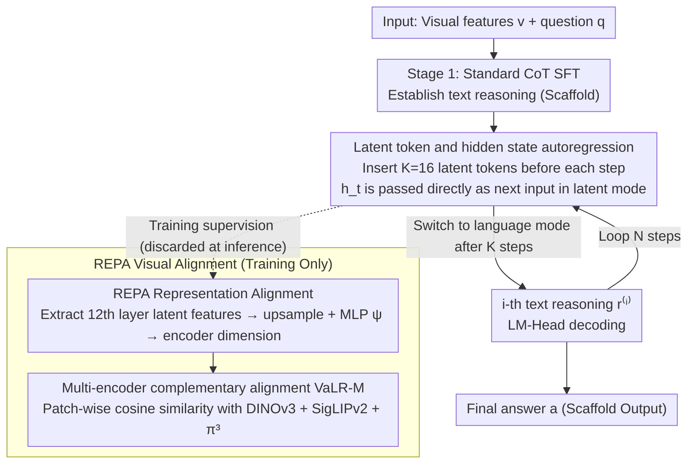

# Vision-aligned Latent Reasoning for Multi-modal Large Language Model

**Conference**: ICML 2026  
**arXiv**: [2602.04476](https://arxiv.org/abs/2602.04476)  
**Code**: Project page available (provided at the end of the paper)  
**Area**: Multi-modal VLM / Visual Reasoning / Test-time scaling  
**Keywords**: Latent reasoning, Visual alignment, REPA, MLLM, Test-time scaling

## TL;DR
This paper proposes VaLR: a method that inserts several "latent tokens" before each step of CoT reasoning in MLLMs and performs representation alignment (REPA) between these tokens and the patch features of visual encoders like DINOv3, SigLIP, or $\pi^3$. This continuously "feeds" visual information back into the model during long-chain reasoning, improving the accuracy of Qwen2.5-VL on VSI-Bench from 33.0% to 52.9% and enabling MLLMs to demonstrate "longer reasoning leads to higher accuracy" test-time scaling behavior for the first time.

## Background & Motivation

**Background**: Existing MLLMs (e.g., Qwen2.5-VL, LLaVA series) generally treat visual features as "initial context"—inserting them once at the beginning of the sequence and then letting the LLM backbone perform pure text CoT reasoning. While effective for short-context VQA, this approach fails in tasks requiring long-chain reasoning (e.g., multi-view spatial reasoning, mathematical geometry).

**Limitations of Prior Work**: The authors provide direct evidence in Figure 2's "Reasoning Length Analysis": as the generation length of Ocean-R1 on MMVP increases from 100 to 300 tokens, accuracy drops from 62.7% to 56.5%. Other latent reasoning methods (Monet, CoVT, LVR) also collapse over long chains. In other words, the "test-time scaling law" enjoyed by text LLMs (longer thinking $\to$ higher accuracy) is reversed in the multi-modal domain: "longer chains = more hallucinations."

**Key Challenge**: The root cause is the **progressive decay of visual signals**. For every additional text token generated autoregressively, the attention weight on the initial visual tokens is diluted. After generating hundreds of reasoning tokens, the model has almost "forgotten" the image. Early solutions that inject image tokens as fixed prefixes (CoVT, Monet) cannot solve this because visual information remains only at the start of the sequence.

**Goal**: Design a mechanism that can "re-activate" the model's perception of the image **before every reasoning step** in CoT, without relying on external visual encoder calls during test time (to avoid inference overhead) while preserving long-chain reasoning capabilities.

**Key Insight**: Inspired by latent reasoning in the LLM domain (e.g., Coconut) and REPA (using external visual features to supervise middle layers of diffusion), the authors hypothesize that by **aligning the intermediate hidden states of the MLLM with the patch features of a frozen visual encoder during training**, the model can learn to "generate its own visual anchors." This maintains visual grounding during test time without requiring an external encoder.

**Core Idea**: Insert $K$ special latent tokens as "visual checkpoints" before each text reasoning step. During training, use the patch features of encoders like DINOv3 to supervise the hidden states corresponding to these latent tokens via cosine similarity. This allows latent tokens to autonomously take on the role of "refreshing visual memory."

## Method

### Overall Architecture
VaLR undergoes two-stage SFT on a standard MLLM (Qwen2.5-VL-7B). During inference, the sequence follows the format $v, q \to (\ell_{[1:K]}^{(1)}, r^{(1)}, \ell_{[1:K]}^{(2)}, r^{(2)}, \cdots) \to a$, where visual features + question $\to$ ($K$ latent tokens + $i$-th step text reasoning) $\times$ $N$ steps $\to$ final answer. The latent token segments are bounded by `<latent>` / `</latent>`. In latent mode, the model uses the previous hidden state $h_t$ directly as the input embedding for the next step (bypassing the LM-Head and token embedding table); in language mode, it reverts to standard token embedding inputs. Each latent segment is fixed at $K=16$ steps before forcing a switch back to language mode. Training is split into two stages: Stage 1 establishes text reasoning capabilities (scaffold) using standard CoT SFT, and Stage 2 introduces latent tokens and applies REPA visual alignment. The visual alignment branch exists only during training and is discarded during inference.

### Key Designs

**1. Latent tokens and hidden state autoregression: Reserving $K$ "thinking slots" before each text reasoning step for internal characterization.**

Pure language CoT forces all intermediate states into discrete tokens, which creates an information bottleneck that cannot accommodate rich visual details. VaLR adds a "scratchpad": during preprocessing, CoT is rewritten from $v,q\to(r^{(i)})_{i=1}^N\to a$ to $v,q\to(\ell_{[1:K]}^{(i)},r^{(i)})_{i=1}^N\to a$. During the forward pass, upon encountering `<latent>`, the next input embedding uses the previous hidden state $E_{t+1}=[E_t;h_t]$ instead of the token embedding $[E_t;e(x_{t+1})]$. This allows the model to operate freely in a continuous hidden space for $K=16$ steps before switching back to language mode for LM-Head decoding. Using continuous hidden states instead of discrete tokens preserves more visual detail, serving as a dedicated space for visual anchoring.

**2. REPA representation alignment to external vision encoders: Internalizing visual grounding by supervising latent tokens with patch features.**

The latent tokens alone are insufficient; they must carry visual information. Following the REPA approach, for step $i$, $K$ latent token features $\mathbf{F}_{\text{MLLM}}^{(i)}$ are extracted from an intermediate layer of the MLLM (default 12th layer). These are upsampled to the patch count $P$ of the vision encoder and projected via an MLP $\psi$ to match the encoder dimension. Patch-wise cosine similarity alignment is performed with $\mathbf{F}_\phi^{(i)}=\phi(I^{(i)})$:

$$\mathcal{L}_{\text{REPA}}=-\frac{1}{NP}\sum_{i,p}\text{sim}(\hat{\mathbf{F}}_{\text{MLLM}}^{(i)}[p,:],\mathbf{F}_\phi^{(i)}[p,:])$$

Crucially, the external encoder is only used during training. The latent tokens learn to produce visually aligned features themselves. Ablations show this is the critical factor: removing visual alignment drops accuracy from 41.5% back to 34.0% (equivalent to vanilla SFT), while using a self-supervised encoder like DINOv3 outperforms the native Qwen encoder by 1.9%, indicating the importance of the alignment objective itself.

**3. Multi-encoder complementary alignment (VaLR-M): Loading latent tokens with heterogeneous visual knowledge.**

Different encoders excel in different visual subspaces. VaLR-M defines $\mathcal{L}_{\text{REPA}}^{\text{multi}}=\frac{1}{M}\sum_m\mathcal{L}_{\text{REPA}}^{(m)}$, assigning a separate projection head $\psi_m$ for each encoder $\phi_m$. The paper uses three ViT-L encoders: DINOv3 (fine-grained appearance), SigLIPv2 (semantic), and $\pi^3$ (3D geometry). Controlled experiments show clear specialization: adding $\pi^3$ contributes most to 3D multi-view tasks like VSI-Bench ($+10$ pts), while DINOv3/SigLIPv2 benefit perception tasks like BLINK/MMVP. Combining all three achieves a state-of-the-art 52.9%. This explicitly injects "expert specialization" into the latent space, effectively distilling a mini multi-view visual backbone inside the MLLM.

### Loss & Training
A two-stage curriculum is used. Stage 1 utilizes 450K CoT VQA data (a mix of Zebra-CoT, CogCoM, Visual-CoT, OneThinker-SFT, etc.) for standard SFT to build basic text CoT capability using $\mathcal{L}_{\text{CE}}$. Stage 2 uses the same data but inserts latent tokens and REPA. The total loss is $\mathcal{L} = \mathcal{L}_{\text{CE}} + \lambda \mathcal{L}_{\text{REPA}}$, where $\lambda = 0.5$ and $K = 16$. In both stages, the native vision encoder is frozen; only the decoder (and the projection MLP in Stage 2) is trained using 4 $\times$ A100 GPUs, ZeRO-2, AdamW, and learning rates of $1 \times 10^{-5}$ / $2 \times 10^{-6}$.

## Key Experimental Results

### Main Results
Comparison on VSI-Bench (multi-view 3D spatial reasoning) and 5 perception benchmarks against GPT-4o, Claude-4, Qwen2.5-VL base, and three latent reasoning baselines.

| Model | VSI-Bench Avg | BLINK | MMVP | V* | CVBench |
|------|---------------|-------|------|-----|---------|
| GPT-4o | 34.0 | 63.0 | 68.7 | 42.9 | 79.2 |
| Qwen2.5-VL-7B (base) | 33.0 | 55.7 | 56.0 | 76.4 | 74.5 |
| + vanilla SFT | 33.7 | 56.6 | 58.7 | 78.0 | 77.0 |
| + Monet (latent baseline) | 14.0 | 49.1 | 50.0 | 83.3 | 71.1 |
| + CoVT | 18.6 | 56.0 | 58.7 | 78.0 | 80.0 |
| + VaLR-S (DINOv3) | 41.5 | 63.1 | 60.3 | 86.4 | 83.1 |
| + VaLR-M (DINOv3+SigLIP+π³) | **52.9** | **64.7** | 60.3 | **86.9** | **87.6** |

VaLR-M improves the base model by $+19.9$ percentage points on VSI-Bench, surpassing GPT-4o by 18.9 points. Notably, existing latent reasoning methods (Monet, CoVT, LVR) collapse to 14-19% on multi-view 3D tasks, highlighting that latent space reasoning without visual re-injection is a dead end.

### Ablation Study

| Configuration | VSI-Bench | BLINK | MMVP | V* |
|------|-----------|-------|------|-----|
| Qwen2.5-VL-7B | 33.0 | 55.7 | 56.0 | 76.4 |
| + vanilla SFT | 33.7 | 56.6 | 58.7 | 78.0 |
| + VaLR w/o VA (no alignment) | 34.0 | 57.1 | 56.7 | 75.9 |
| + VaLR w/ QE (using native encoder) | 39.6 | 58.9 | 60.0 | 81.7 |
| + VaLR (DINOv3) | 41.5 | 63.1 | 60.3 | 86.4 |

Ablations on alignment layer position (Front/Middle/Last, i.e., layers 4/12/27) show the middle layer (layer 12) is optimal, consistent with the original REPA and other studies suggesting visual information is concentrated in the middle layers of MLLMs.

### Key Findings
- **REPA is critical**: Without alignment, VaLR degrades to vanilla SFT. Alignment is the source of the $+8$ pts gain, proving latent tokens are just "carriers" whereas the explicit injection of signals is key.
- **Test-time scaling emerges**: VaLR is the only method where "thinking longer" improves accuracy (Fig 2). Other methods collapse after a certain length. This successfully transfers the scaling law from text LLMs to the multi-modal domain.
- **Expert coordination**: $\pi^3$ specifically boosts 3D multi-view tasks, while DINOv3/SigLIP boost perception. Their combination is additive, showing the latent space is large enough for multi-source knowledge.
- **Data scaling >20× faster convergence**: VaLR achieves a V* performance with 50K data that vanilla SFT requires 450K to reach.

## Highlights & Insights
- Synergizing "latent reasoning" and "REPA" addresses the true bottleneck of long-chain MLLM reasoning—visual signal decay—rather than just proposing a "fancier architecture."
- **Efficiency at inference**: No external encoders are needed at test time. The visual alignment is distilled into the MLLM's intermediate layers, offering high engineering value compared to expensive multi-encoder methods.
- The concept of latent tokens as "visual refresh slots" is generalizable: it could be used for long-context RAG (re-activating retrieval features) or long video descriptions (pulling back visual features every $N$ frames).
- Integrating geometric encoders like $\pi^{3}$ for a $+10$ pts boost on 3D tasks demonstrates that latent space alignment is naturally suited for "non-linguistically describable" visual modalities, providing a path to integrate 3D/haptic/audio without relying on captioning.

## Limitations & Future Work
- The number of latent tokens $K=16$ is fixed. Different reasoning steps likely have different "visual hunger," suggesting a need for adaptive budget allocation.
- The training relies solely on synthetic CoT data (Zebra-CoT, etc.). The impact on "non-reasoning VQA" (e.g., style judgment) has not been fully evaluated, risking over-adjustment to the reasoning distribution.
- Multi-encoder alignment increases training costs due to multiple ViT-L forward passes. Budget scaling to 32B/72B models remains expensive.
- Geometric encoders like $\pi^3$ require multi-view inputs and are not applicable to single-image VQA; the exploration of visual representation families for latent alignment is ongoing.
- While the test-time scaling curve grows, the "marginal cost vs. gain" curve is not systematically mapped, making "when to stop" an open question for industrial deployment.

## Related Work & Insights
- **vs. CoVT / Monet**: These methods inject visual features as a one-time fixed prefix. VaLR performs dynamic re-injection before every step, marking a paradigm shift from "static" to "dynamic."
- **vs. Coconut**: Coconut performs latent reasoning on pure text LLMs without visual supervision. VaLR transfers this to MLLMs and uses REPA to solve the visual information loss in latent space.
- **vs. REPA**: Originally used for diffusion models, VaLR adapts REPA to autoregressive MLLM latent tokens, proving its utility extends far beyond generative models.
- **vs. Visual CoT / Imagine-then-Reason**: Those methods explicitly generate intermediate images or tokens, which is costly and limited by image generator quality. VaLR achieves similar goals in latent space—lighter and more controllable.

## Rating
- Novelty: ⭐⭐⭐⭐ — Excellent combination of latent reasoning and REPA, though components are not independently original.
- Experimental Thoroughness: ⭐⭐⭐⭐⭐ — Comprehensive ablation on 6 benchmarks, encoders, layer positions, and data scales; first depiction of a multi-modal test-time scaling curve.
- Writing Quality: ⭐⭐⭐⭐ — Very clear motivation; Figure 2 effectively distinguishes it from baselines. REPA formulas could be more concise.
- Value: ⭐⭐⭐⭐⭐ — A $+19.9$ pts gain on VSI-Bench is significant and practically "free" for existing MLLM training pipelines since no external models are added at inference.

<!-- RELATED:START -->

## Related Papers

- [\[ICLR 2026\] Reasoning-Aligned Perception Decoupling for Scalable Multi-modal Reasoning](../../ICLR2026/vlm_reasoning/reasoning-aligned_perception_decoupling_for_scalable_multi-modal_reasoning.md)
- [\[ICML 2026\] From Correspondence to Actions: Human-Like Multi-Image Spatial Reasoning in Multi-modal Large Language Models](from_correspondence_to_actions_human-like_multi-image_spatial_reasoning_in_multi.md)
- [\[CVPR 2026\] dMLLM-TTS: Self-Verified and Efficient Test-Time Scaling for Diffusion Multi-Modal Large Language Models](../../CVPR2026/vlm_reasoning/dmllm-tts_self-verified_and_efficient_test-time_scaling_for_diffusion_multi-moda.md)
- [\[ICML 2026\] Native Active Perception as Reasoning for Omni-Modal Understanding](native_active_perception_as_reasoning_for_omni-modal_understanding.md)
- [\[ICLR 2026\] Vision-SR1: Self-Rewarding Vision-Language Model via Reasoning Decomposition and Multi-Reward Policy Optimization](../../ICLR2026/vlm_reasoning/vision-sr1_self-rewarding_vision-language_model_via_reasoning_decomposition_and_.md)

<!-- RELATED:END -->
