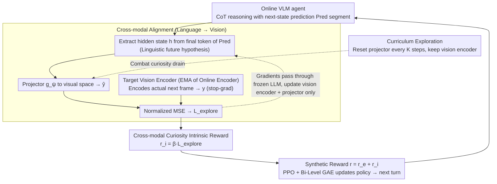

# What You Think is What You See: Driving Exploration in VLM Agents via Visual-Linguistic Curiosity (GLANCE)

**Conference**: ICML 2026 Spotlight  
**arXiv**: [2605.03782](https://arxiv.org/abs/2605.03782)  
**Code**: Not yet released (None)  
**Area**: Multimodal VLM / Reinforcement Learning / Agent Exploration  
**Keywords**: VLM agent, curiosity-driven exploration, cross-modal alignment, internalized world model, curiosity drain

## TL;DR
GLANCE introduces a self-supervised "think-and-see alignment" head for RL in VLM agents: the "next-state prediction" generated in the LLM's CoT is mapped via a lightweight projector to the representation of the actual next frame encoded by an EMA target visual encoder. The gap between prediction and reality serves simultaneously as an intrinsic curiosity reward, a training signal for the visual encoder, and an alignment loss to ground the internalized world model. Combined with a curriculum exploration mechanism that periodically resets the projector to combat curiosity drain, GLANCE consistently outperforms existing exploitation-only VLM-RL methods across 5 agentic tasks.

## Background & Motivation

**Background**: Current VLM agents (such as VAGEN, InternVL-Agent, etc.) increasingly tend to internalize "world modeling" within their policies. They utilize explicit CoT to produce structured reasoning like `<Obs>s_t</Obs><Res>z_t</Res><Pred>s_{t+1}</Pred>` at each turn, followed by an action `<Ans>a_t</Ans>`, learning an integrated reasoning-action policy through PPO-like algorithms combined with sparse extrinsic rewards.

**Limitations of Prior Work**: These methods essentially perform "passive exploitation of visited states"—the agent only refines its reasoning on states it has already encountered, lacking any mechanism to actively explore areas where "its own model is uncertain." In sparse reward tasks (e.g., Sokoban, 3D navigation), this often leads to "pseudo-success," where the agent perfectly describes a dead end but never attempts an alternative path. Conversely, traditional curiosity methods (ICM, BYOL-Explore, Latent Curiosity) only focus on vision-to-vision prediction errors, which are entirely decoupled from the VLM's internalized linguistic world model. Even if visual representations are well-learned, linguistic reasoning may continue to hallucinate.

**Key Challenge**: While the world model of VLM agents has shifted from "external RNN/Transformers" to the internal CoT of the LLM, curiosity mechanisms remain in an external vision-only form. When these two are misaligned, the agent falls into one of two failure modes: (a) imagining scenarios linguistically that the visual representation cannot perceive; or (b) having rich visual representations while linguistic reasoning remains detached from physical reality.

**Goal**: Construct a unified objective where "what the agent thinks" must predict "what the agent sees," transforming prediction failures into active exploration motivation. Simultaneously, address the "curiosity drain" problem where curiosity signals decay too rapidly during long-term training.

**Key Insight**: The authors leverage the cross-modal signal of "linguistic prediction vs. visual reality." The hidden state of the VLM at the `<Pred>` token is inherently the model's semantic-level guess of the future. By projecting this into visual space and aligning it with the actual next-frame representation, the prediction error naturally serves as (i) an alignment loss (forcing the vision encoder to learn semantically actionable features), (ii) supervision for grounding the world model, and (iii) an intrinsic curiosity reward—killing three birds with one stone.

**Core Idea**: Replace "visual past ↔ visual future" with cross-modal prediction error between "linguistic hypothesis ↔ visual reality," making curiosity a process of "active falsification" rather than "random search."

## Method

### Overall Architecture
GLANCE treats the VLM agent as a policy under a partially observable MDP $(\mathcal{S}, \mathcal{A}, \mathcal{O}, T, R, Z, \gamma)$, constructing an online-target twin-stream architecture: (i) **Online VLM agent** $\boldsymbol{\theta} = (\mathbf{v}, \boldsymbol{\ell})$ comprising a trainable vision encoder $f_\mathbf{v}$, a frozen LLM backbone $\Lambda_\boldsymbol{\ell}$, and a lightweight projector $g_\boldsymbol{\psi}$; (ii) **Momentum target network** $\boldsymbol{\phi}$ as an EMA copy of the vision encoder. At each turn $t$: the online agent generates a CoT $\Phi_t$ containing the state prediction $s_{t+1}$, taking the hidden state $h_{t+1} \in \mathbb{R}^d$ of the final token in the `<Pred>` segment as the "linguistic hypothesis." After executing action $a_t$ to obtain $o_{t+1}$, the target encodes the observation $y_{t+1} = \text{sg}(f_\phi(o_{t+1}))$. The online projector yields $\hat{y}_{t+1} = g_\psi(h_{t+1})$. Both are normalized to calculate the MSE for $\mathcal{L}_\text{explore}$. This loss is backpropagated to update $g_\psi$ and $f_\mathbf{v}$ (with the LLM frozen) and is added as an intrinsic reward $r_t^i = \beta \cdot \mathcal{L}_\text{explore}$ to the extrinsic rewards $r_t^e = r_t^\text{task} + r_t^\text{reason} + r_t^\text{format}$. The following diagram illustrates this "think-see alignment" self-supervised loop:

### Key Designs

**1. Linguistic-to-Visual Cross-modal Alignment: Translating linguistic "future guesses" to visual space for alignment with reality**

Traditional BYOL/SPR-style visual self-supervision only performs "vision-to-vision" prediction, which cannot guarantee that linguistic reasoning and visual perception refer to the same entities. GLANCE captures the cross-modal signal of "linguistic prediction vs. visual reality." The hidden state $h_{t+1}$ from the last layer of the Transformer at the end of the `<Pred>s_{t+1}</Pred>` CoT segment represents the "linguistically implicitly encoded future state." A lightweight projector $g_\psi$ maps this to the visual space as $\hat{y}_{t+1} = g_\psi(h_{t+1})$. The target vision encoder $f_\phi$ is updated via EMA $\phi \leftarrow \alpha \phi + (1-\alpha) \mathbf{v}$ to encode the actual next frame $y_{t+1}$. The alignment loss is a BYOL-style normalized MSE: $\mathcal{L}_\text{explore} = \|\frac{\hat{y}_{t+1}}{\|\hat{y}_{t+1}\|_2} - \text{sg}(\frac{y_{t+1}}{\|y_{t+1}\|_2})\|_2^2$, with a stop-gradient on the target side to prevent collapse. The critical "selective gradient routing" allows gradients to pass through the frozen LLM but only updates the projector $g_\psi$ and the online vision encoder $f_\mathbf{v}$. This avoids language drift while forcing the vision encoder to learn "semantically actionable" features, pulling the world model from language into physical reality.

**2. Cross-modal Curiosity as Intrinsic Reward: Reusing alignment error as an exploration drive for active falsification**

Standard ICM-style curiosity focuses only on visual prediction errors, which are decoupled from LLM reasoning, potentially leading to a "pseudo-equilibrium" where visual representations are well-learned but language still hallucinates. GLANCE directly utilizes the current turn's $\mathcal{L}_\text{explore}$ as the intrinsic reward $r_t^i = \beta \cdot \mathcal{L}_\text{explore}(\mathbf{v}, \boldsymbol{\psi}, t)$. This is combined with extrinsic rewards $r_t = r_t^e + r_t^i$ and fed into a PPO-style Bi-Level GAE for token-to-turn hierarchical credit assignment. Intuitively, a high $\mathcal{L}_\text{explore}$ indicates that the "predicted future in language differs significantly from the observed reality," pointing to "known unknowns" most worth exploring. Conversely, low-loss regions represent familiar states. Since curiosity and world-model grounding share the same objective, the agent must refine both reasoning and perception to reduce the loss—a fundamental difference from vision-only ICM.

**3. Curriculum Exploration: Periodic projector resets to combat curiosity drain**

The authors discovered a new collapse mode: since the LLM backbone has strong semantics, a lightweight projector can easily overfit linguistic hidden states to "surface-level visual features" early in training. This causes $\mathcal{L}_\text{explore}$ to rapidly approach zero, making intrinsic rewards disappear and leading the agent to falsely believe it has "mastered the environment." This is not a representation collapse but a "false mastery" illusion that stop-gradients cannot fix. GLANCE periodically re-initializes the weights of the projector $g_\psi$ while retaining the evolved vision encoder $f_\mathbf{v}$. The new projector, devoid of "old tricks," is forced to recalibrate using the richer features already learned by the vision encoder, re-exposing fine-grained differences previously smoothed out by the old projector. Without this mechanism, $\mathcal{L}_\text{explore}$ tends to vanish within the first 10%–20% of training, halting exploration.

### Loss & Training
The total optimization objective is split into two paths:
- **Self-supervised Path**: $\min_{\mathbf{v}, \boldsymbol{\psi}} \mathcal{L}_\text{explore}$, with the LLM frozen.
- **RL Path**: PPO maximizes $\mathcal{J}(\boldsymbol{\theta}) = \mathbb{E}[\sum_t \gamma^t r_t]$ where $r_t = r_t^e + r_t^i$, using Bi-Level GAE to propagate turn-level rewards back to token-level.
The LLM is frozen throughout, updating only the projector, vision encoder, and trainable adapter layers in RL. The target network uses EMA $\phi \leftarrow \alpha \phi + (1-\alpha) \mathbf{v}$. The curriculum step resets the projector every $K$ iterations.

## Key Experimental Results

### Main Results
Five agentic tasks (Grid Puzzles, Sokoban, 3D Navigation, Object Manipulation/PrimitiveSkill, Geometric/SVG Reconstruction) were tested using Qwen2.5-VL-3B as the backbone. Primary metrics: average success rate for puzzles/embodied tasks, and average perceptual similarity (DINO+DreamSim) for SVG.

| Benchmark | VAGEN (exploitation-only) | GLANCE (Ours) | Description |
|---|---|---|---|
| Sokoban | Baseline | Significant Gain | Sparse rewards + long horizon; curiosity yields maximum benefit |
| 3D Navigation | Baseline | Significant Gain | High visual partial observability |
| PrimitiveSkill | Baseline | Significant Gain | Requires predicting physical outcomes of "stack/move" |
| Grid Puzzles | Baseline | Significant Gain | Tight reasoning-perception coupling |
| SVG Reconstruction | Baseline | Significant Gain | Averaged DINO+DreamSim |

The authors also reported "zero extrinsic reward" experiments: with $r_t^e$ set to 0, GLANCE still learns meaningful exploration policies, while the exploitation-only baseline fails to start learning at all—proving cross-modal curiosity can independently drive exploration.

### Ablation Study

| Configuration | Phenomenon | Description |
|---|---|---|
| Full GLANCE | Stable training; $\mathcal{L}_\text{explore}$ decays but is re-invigorated by curriculum | Full model |
| w/o Curriculum Exploration | $\mathcal{L}_\text{explore}$ collapses to ≈0 early, halting exploration | Validates "curiosity drain" and necessity of curriculum |
| w/o cross-modal alignment (Pure visual BYOL) | Visual features learned but language still hallucinates; performance drops in long-horizon tasks | Validates necessity of using language hidden states for grounding |
| w/o EMA target (Online network as target) | Representation collapse | Validates necessity of stop-gradient + EMA |

### Key Findings
- Cross-modal curiosity can operate independently of extrinsic rewards: In zero $r_t^e$ settings, GLANCE still learns exploration strategies, which is impossible for vision-only ICM, proving the "linguistic-visual" signal inherently contains semantic information about "where the problems are."
- Curriculum resetting of the projector is indispensable: Without it, $\mathcal{L}_\text{explore}$ vanishes in the first 10%–20% of training, causing the agent to enter a "false mastery" plateau.
- Selective gradient routing (freezing LLM, allowing vision encoder and projector updates) balances "no language drift" with "learning semantic vision," which is key for integrating self-supervised loss into VLMs.

## Highlights & Insights
- **"Think-See Alignment" as a Unified Objective**: The authors use a single $\mathcal{L}_\text{explore}$ to solve three problems simultaneously—intrinsic rewards, visual representation learning, and world model grounding. This "one loss for multiple gains" design is elegant and highly effective.
- **Hidden State Retrieval from `<Pred>` Tokens**: This step naturally bridges the "VLM internal world model" with "self-supervised alignment," representing a key observation of the architectural differences between VLM agents and traditional RL agents.
- **Concept of Curiosity Drain**: The authors define and systematically discuss "curiosity drain"—a failure mode where lightweight projectors overfit rich semantics too quickly. The low-cost curriculum solution (simply resetting weights) is highly effective and transferable.
- **Learning with Zero Extrinsic Rewards**: The fact that pure curiosity can drive learning suggests VLM agents can "hot-start" in new environments through cross-modal self-supervision before extrinsic reward structures are discovered.

## Limitations & Future Work
- Code is not yet public, and specific hyperparameters ($\beta$, curriculum period $K$, EMA $\alpha$) are only described broadly, posing a high replication threshold.
- Primary experiments used only Qwen2.5-VL-3B; whether larger models (7B/72B) or stronger encoders (SigLIP-2) require recalibrating the curriculum period is unverified.
- Defining "linguistic hypothesis" as only the `<Pred>` token terminal state is rigid; information might be distributed across intermediate tokens. Attention pooling or averaging could be considered.
- Online vision encoder updates during RL might degrade pre-trained vision-language alignment; this drop in zero-shot visual capabilities is not quantified.
- Tasks are largely controlled simulator environments; generalization to open-domain web or robotic agent scenarios remains untested.

## Related Work & Insights
- **vs. ICM / RND / Latent Curiosity**: Classic curiosity focuses on "vision → vision" or "action → vision" prediction errors. GLANCE shifts to "language → vision" alignment, directly interfacing with the VLM's internalized world model.
- **vs. BYOL-Explore**: BYOL-Explore uses visual bootstrap for intrinsic rewards but remains decoupled from LLM reasoning. GLANCE adopts the BYOL framework (stop-gradient + EMA) but uses LLM hidden states as the query source.
- **vs. VAGEN / InternVL-Agent**: These frameworks internalize world models but focus on exploitation. GLANCE acts as a plug-and-play exploration enhancement for them.
- **Insight**: The paradigm of "Modality A representation → Modality B actual representation" as a dual alignment/curiosity objective could be extended to other multimodal agents (e.g., audio-visual or text-to-control).

## Rating
- Novelty: ⭐⭐⭐⭐⭐ The "linguistic prediction vs. visual reality" objective, curiosity drain, and curriculum projector are all novel and elegantly combined.
- Experimental Thoroughness: ⭐⭐⭐⭐ Covers multiple categories (puzzles, navigation, etc.), and the zero-reward ablation is compelling, though limited to one backbone.
- Writing Quality: ⭐⭐⭐⭐ Clear motivation and consistent narrative.
- Value: ⭐⭐⭐⭐ Provides a plug-and-play exploration module for VLM-RL with significant gains in long-horizon/sparse-reward tasks; highly relevant for embodied and web agent training.

<!-- RELATED:START -->

## Related Papers

- [\[CVPR 2026\] See, Think, Act: Teaching Multimodal Agents to Effectively Interact with GUI by Identifying Toggles](../../CVPR2026/vlm_reasoning/see_think_act_teaching_multimodal_agents_to_effectively_interact_with_gui_by_ide.md)
- [\[CVPR 2026\] See Further, Think Deeper: Advancing VLM's Reasoning Ability with Low-level Visual Cues and Reflection](../../CVPR2026/vlm_reasoning/see_further_think_deeper_advancing_vlms_reasoning_ability_with_low-level_visual_.md)
- [\[CVPR 2026\] Hear you are: Teaching LLMs Spatial Reasoning with Vision and Spatial Sound](../../CVPR2026/vlm_reasoning/hear_you_are_teaching_llms_spatial_reasoning_with_vision_and_spatial_sound.md)
- [\[ACL 2026\] What's Missing in Screen-to-Action? Towards a UI-in-the-Loop Paradigm for Multimodal GUI Reasoning](../../ACL2026/vlm_reasoning/what39s_missing_in_screen-to-action_towards_a_ui-in-the-loop_paradigm_for_multim.md)
- [\[CVPR 2026\] CARE What Fails: Contrastive Anchored-REflection for Verifiable Multimodal Reasoning](../../CVPR2026/vlm_reasoning/care_what_fails_contrastive_anchored-reflection_for_verifiable_multimodal_reason.md)

<!-- RELATED:END -->
